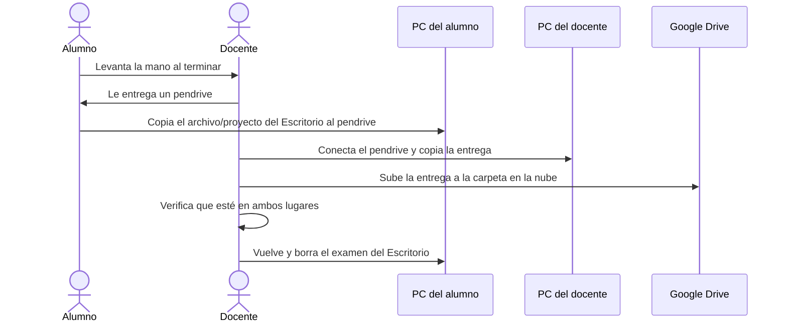

# Metodología de entrega de exámenes — Taller de Programación

> **Propósito de este documento:** describir el problema que se busca resolver con SEEP (Sistema de Entrega de Exámenes Parciales): cómo se entregan hoy los exámenes en computadora, qué falla en ese proceso y qué características debería tener una solución.

---

## Índice

1. [Contexto del examen](#1-contexto-del-examen)
2. [Modelo actual de entrega (pendrive)](#2-modelo-actual-de-entrega-pendrive)
3. [Modelos alternativos ya probados](#3-modelos-alternativos-ya-probados)
4. [Reglas de la entrega](#4-reglas-de-la-entrega)
5. [Modelo deseado y requisitos](#5-modelo-deseado-y-requisitos)
6. [Restricciones del entorno](#6-restricciones-del-entorno)
7. [Después del examen](#7-después-del-examen)
8. [Plan B: contingencia](#8-plan-b-contingencia)
9. [Fuera de alcance (por ahora)](#9-fuera-de-alcance-por-ahora)
10. [Preguntas abiertas](#10-preguntas-abiertas)

---

## 1. Contexto del examen

En la cátedra de **Taller de Programación** los alumnos rinden exámenes en computadora:

- Cada alumno recibe una computadora de la facultad durante el examen.
- La consigna se entrega **en papel**.
- El examen tiene un **tiempo máximo** (por ejemplo, 90 minutos).
- Para resolverlo, el alumno debe crear **en el Escritorio** (condición necesaria) un archivo o proyecto llamado **`APELLIDO_NOMBRE`**.

### Escala

| Dimensión | Valor |
|---|---|
| Alumnos por turno | ~70 |
| Aulas en simultáneo | Hasta 2 |
| Docentes por aula | Entre 2 y 5 |
| Receptor de entregas | **Uno por aula**, en la PC del docente de esa aula |
| Turnos | Varios turnos seguidos sobre las **mismas máquinas**. Cada examen es un turno. |
| Pico de entregas | ~**85 %** de las entregas llegan en los **últimos 10 minutos** (≈ 60 entregas, ~1 cada 10 segundos si son 70 alumnos) |

> Como hay turnos consecutivos, cada computadora debe quedar **limpia** (sin el examen anterior) antes de que llegue el próximo alumno. Si no, el siguiente podría ver o copiar el examen previo.

### Qué entrega el alumno según el módulo

| Módulo | Lenguaje / entorno | Qué se entrega | Extensión |
|---|---|---|---|
| **Programación Imperativa** | Pascal | Un único archivo fuente | `.pas` |
| **Programación Orientada a Objetos** | Java, en NetBeans | Alcanza con los **fuentes**. También se acepta el proyecto NetBeans completo (directorio con paquetes y librerías). | — (carpeta) |
| **Programación Concurrente** | R-INFO (entorno desarrollado por la Facultad de Informática) | Un **único** archivo de texto plano | Sin extensión fija (podría ser `.rinfo` o `.crmi`) |

---

## 2. Modelo actual de entrega (pendrive)

### Flujo



1. A medida que terminan, los alumnos **levantan la mano** para que un docente se acerque y les entregue un pendrive.
2. El alumno conecta el pendrive, **copia** su archivo o proyecto desde el Escritorio y lo pega en el pendrive.
3. El docente se lleva el pendrive, lo conecta en **su computadora** y copia allí la entrega.
4. El docente sube la entrega a un directorio en la nube (**Google Drive**).
5. Cuando el docente confirma que la entrega está en **dos lugares** (su computadora y la nube), vuelve a la computadora del alumno y **elimina el examen del Escritorio**, dejándola "limpia" para el próximo turno de examen.

### Problemas del modelo actual

- ⏱️ **Es lento:** genera mucha espera cuando varios alumnos quieren entregar a la vez. Con el pico de ~1 entrega cada 10 segundos, es prácticamente imposible atenderlo con 2 a 5 docentes.
- 👥 **Requiere varios docentes** presentes en el aula.
- 💾 **Depende del hardware:** cada docente necesita un pendrive, y los pendrives pueden fallar.
- 🖥️ **Compatibilidad entre sistemas operativos:** las computadoras de la facultad usan Windows, pero el docente puede usar Windows, Linux o macOS.
- 📋 **Es frágil:** la secuencia de pasos debe respetarse a rajatabla; un error (por ejemplo, borrar antes de confirmar la copia) puede hacer perder una entrega.

---

## 3. Modelos alternativos ya probados

Se probaron otros mecanismos, en particular:

- Envío como **archivo adjunto** en un mensaje de la plataforma **IDEAS** (campus virtual de la facultad).
- Envío por **correo electrónico** (sobre todo durante la pandemia).

### Problemas encontrados

1. 🌐 **Requieren conexión a internet**, que no siempre se puede asegurar (por ejemplo, por saturación de la red cuando hay muchos alumnos).
2. 📎 **Dependen de que el alumno no se olvide** de adjuntar los archivos al mensaje.
3. 🚫 **Bloqueo de adjuntos:** en Java puede ser necesario "limpiar" el proyecto (eliminar los `.jar` de librerías externas), porque algunas plataformas de correo bloquean esos archivos.

---

## 4. Reglas de la entrega

| Regla | Descripción |
|---|---|
| **Datos del alumno** | Nombre(s), apellido(s) y **legajo**. Si el alumno no recuerda su legajo, puede usar el **DNI**. |
| **Datos tal cual** | El sistema **no corrige** los datos ni los contrasta contra la planilla de inscriptos. Los apellidos compuestos van **completos** y los caracteres especiales (acentos, ñ, etc.) se **respetan**. |
| **Entrega autónoma** | El alumno entrega **solo**, sin que un docente tenga que acercarse. |
| **Retiro controlado** | El **docente** decide si el alumno puede retirarse, después de verificar que la entrega se realizó. |
| **Entrega en blanco** | Incluso si entrega en blanco, el alumno **debe enviar un archivo**: vacío, con su nombre y un texto que indique que entrega en blanco. |
| **Sin reentregas** | Cada alumno entrega **una sola vez**, salvo que el **docente habilite una reentrega** (ver [Reentregas](#reentregas)). |
| **Sin control de tiempo** | El sistema no necesita rechazar entregas fuera de hora, pero sí debe **registrar el momento de entrega** de cada alumno. |
| **Confirmación** | Al entregar, el alumno recibe un **mensaje de OK**. |

### Reentregas

| Situación | Qué pasa |
|---|---|
| El alumno **no vio el OK** | Le consulta al docente, que verifica en su receptor si la entrega llegó bien. Si llegó, se lo confirma. |
| La entrega **no llegó** o llegó mal | El docente **habilita** al alumno para volver a entregar. |
| El alumno **se equivocó de archivo** | El docente también puede **habilitar** la reentrega. |

- La reentrega **siempre** requiere la habilitación del docente. El sistema nunca la acepta por su cuenta.
- **Siempre se conservan las entregas anteriores**, como registro, marcadas como **no finales**. Solo la última entrega es la que se evalúa.

---

## 5. Modelo deseado y requisitos

> Que los alumnos puedan **enviar el examen directamente desde su computadora a la computadora del docente**, sin que un docente tenga que intervenir en cada entrega.

### Amenazas que se quieren evitar

- 🎭 **Suplantación:** que un alumno diga ser otro alumno.
- 👀 **Acceso a entregas ajenas:** que un alumno vea o acceda a la solución de otro alumno.

### Requisitos

> Los marcados con *(derivado)* no fueron pedidos explícitamente, pero se desprenden de las reglas y del contexto.

| # | Requisito | Detalle |
|---|---|---|
| R1 | **Envío directo** alumno → docente | Sin intermediarios físicos (pendrive) ni dependencia de internet. |
| R2 | **Confidencialidad** | Un alumno no debe poder ver ni obtener la entrega de otro, ni desde el receptor del docente ni a través de la red. |
| R3 | **Identificación del alumno** | Cada entrega queda asociada a nombre, apellido y legajo/DNI, guardados exactamente como se ingresaron. |
| R4 | **Mitigar la suplantación** | Como no se valida contra la planilla, el control es **presencial**: el docente debe poder comprobar quién entregó qué antes de dejar retirarse al alumno. *(derivado)* |
| R5 | **Integridad** | Los archivos no deben corromperse durante el envío. |
| R6 | **Detección de errores** | Detectar los errores de comunicación e **informarlos** al alumno y al docente. El OK solo se muestra si la entrega quedó guardada. |
| R7 | **Nombre correcto** | La entrega queda guardada con un nombre construido a partir de los datos del alumno (`APELLIDO_NOMBRE`), sin alterar caracteres especiales. |
| R8 | **Reentrega solo con habilitación** | No se aceptan reentregas de un mismo alumno, salvo que el docente lo **habilite** desde su receptor. |
| R8b | **Historial de entregas** | Las entregas reemplazadas se conservan, claramente marcadas como **no finales**. Debe ser evidente cuál es la entrega final de cada alumno. |
| R9 | **Registro de entregas** | Guardar el momento de entrega de cada alumno. |
| R10 | **Panel del docente** | El docente debe ver qué alumnos ya entregaron, para decidir quién puede retirarse, poder **confirmarle a un alumno que su entrega llegó bien** y **habilitar reentregas**. |
| R11 | **Evidencia ante reclamos** | Siempre habrá reclamos del tipo "yo entregué y no llegó". El registro debe permitir demostrar qué llegó, de quién y cuándo. *(derivado)* |
| R12 | **Soportar el pico de entregas** | Recibir ~60 entregas en ~10 minutos, muchas simultáneas. |
| R13 | **Instalación coordinada** | El cliente del alumno y el receptor del docente se instalan con ayuda de los responsables de los equipos. En el uso diario deben funcionar **sin permisos de administrador**. *(derivado)* |
| R14 | **Un receptor por aula** | Con 2 aulas en paralelo, cada una tiene su propio receptor. Cada alumno debe entregar al receptor de **su** aula, sin confundirse con el de la otra. *(derivado)* |

---

## 6. Restricciones del entorno

### Equipos

- Las computadoras de los alumnos usan **Windows**.
- **Todas las aulas tienen una PC para el docente con Windows.** Algunos docentes usan además su propia notebook (Windows, Linux o macOS). El soporte de Linux/macOS **no es prioritario** por ahora.
- ⚠️ **Ni los alumnos ni los docentes tienen permisos de administrador** en las computadoras de la facultad: no pueden instalar software ni cambiar la configuración del sistema.
  - **Acción en curso:** la cátedra hablará con los responsables de los equipos para que permitan **instalar el sistema** (y configurar lo necesario, como el firewall de la PC del docente).

### Red

- **No se puede asegurar la conexión a internet** durante el examen.
- **Red local:** todas las computadoras (alumnos y docente) se conectan por **WiFi** a la **misma red**.
  - Implica que el ancho de banda es compartido: en el pico (~60 entregas en 10 minutos) todas las subidas compiten por el mismo WiFi. Esto importa sobre todo con los proyectos Java, que pueden incluir `.jar`.
- ⚠️ **Riesgo: comunicación entre equipos posiblemente bloqueada.** Se sospecha (sin confirmar) que la red WiFi impide la comunicación directa entre equipos (*AP/client isolation* o firewall). Si es así, una conexión directa alumno → docente por esa red **no funcionaría**, y habría que pensar alternativas (por ejemplo, una red propia levantada por el docente).
- ⚠️ **Riesgo: firewall de Windows en la PC del docente.** Para recibir entregas, la PC del docente tiene que aceptar conexiones entrantes. Normalmente Windows lo bloquea, y habilitarlo requiere permisos de administrador, que los docentes no tienen. Se espera resolverlo junto con los responsables de los equipos (ver [Equipos](#equipos)).

---

## 7. Después del examen

- **Respaldo en Google Drive:** lo hace **manualmente** el docente a cargo.
- **Organización de la carpeta:**

  ```text
  Drive/
  └── <Turno>/              ← cada examen es un turno
      ├── <Aula 1>/         ← solo si hay varias aulas en paralelo
      │   └── APELLIDO_NOMBRE...
      └── <Aula 2>/
          └── APELLIDO_NOMBRE...
  ```

- **Limpieza de las computadoras:** por ahora el sistema **no borra nada**. La limpieza del Escritorio entre turnos sigue siendo manual.

---

## 8. Plan B: contingencia

Si el sistema falla durante el examen, se vuelve al **modelo con pendrive** ([sección 2](#2-modelo-actual-de-entrega-pendrive)).

> **Pendiente de documentar:** criterios para activar el plan B, qué hacer con los alumnos que ya entregaron por el sistema y cómo unificar ambas fuentes de entregas antes de subirlas al Drive.

---

## 9. Fuera de alcance (por ahora)

- Borrado automático del examen en la computadora del alumno (quizás a futuro).
- Subida automática a Google Drive.
- Validación de los datos del alumno contra la planilla de inscriptos.
- Control del tiempo límite del examen.
- Uso por otras cátedras. Por el momento el sistema es solo para Taller de Programación.

---

## 10. Preguntas abiertas

> Las preguntas ya respondidas se incorporaron al cuerpo del documento. Acá quedan solo las pendientes.

### Escala y logística
- [ ] ¿Los ~70 alumnos son el total del turno (repartidos entre las 2 aulas) o por aula?
- [ ] ¿Cuánto tiempo queda entre un turno y el siguiente? ¿Los turnos consecutivos rinden el mismo examen o uno distinto?

### Red e infraestructura
- [ ] ¿La red WiFi es exclusiva del laboratorio o es la red general de la facultad? ¿Las 2 aulas usan la misma red?
- [ ] ¿La red bloquea la comunicación entre equipos? → **Sin confirmar; se sospecha que sí.** Verificar con una prueba real en el aula.
- [ ] **Coordinar con los responsables de los equipos:** instalar el cliente en las PCs de los alumnos y el receptor en la PC del docente, y habilitar en el firewall las conexiones entrantes al receptor. *(en curso)*
- [ ] ¿Esos mismos responsables administran la red WiFi, o es otro equipo? ¿Se les puede pedir que habiliten la comunicación entre equipos?
- [ ] ¿Se permite que el docente levante su propia red (hotspot o router portátil) en el aula?

### Seguridad e identidad
- [ ] Antes de dejar retirarse a un alumno, ¿el docente verifica su identidad (DNI o libreta) contra lo que entregó?
- [ ] ¿Cómo se detecta una reentrega si un alumno usa el legajo una vez y el DNI otra?

### Reglas de la entrega
- [ ] ¿Cómo verifica el docente que una entrega "llegó bien"? ¿Le alcanza con verla en el panel, o necesita poder abrir el archivo en ese momento?
- [ ] ¿Hace falta registrar quién habilitó cada reentrega y por qué motivo (no llegó o archivo equivocado)?
- [ ] Para la entrega en blanco, ¿conviene que el sistema ofrezca un botón "Entregar en blanco" que genere el archivo automáticamente?
- [ ] ¿Qué tamaño máximo tiene un proyecto NetBeans completo?

### Plan B
- [ ] ¿Quién decide pasar al plan B y en qué condiciones?
